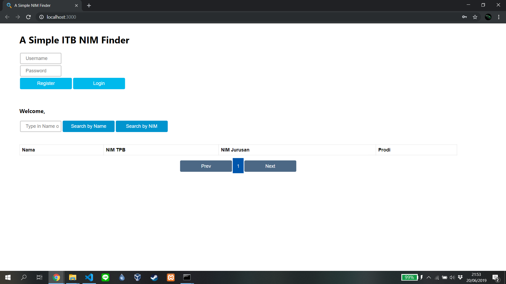
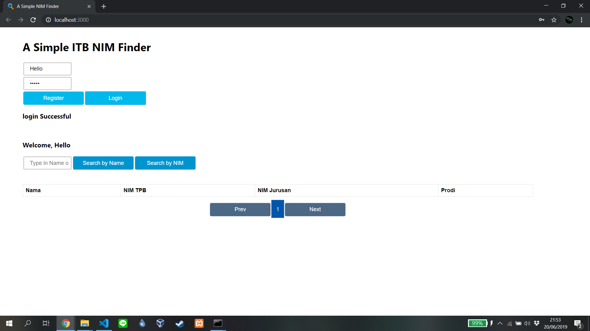
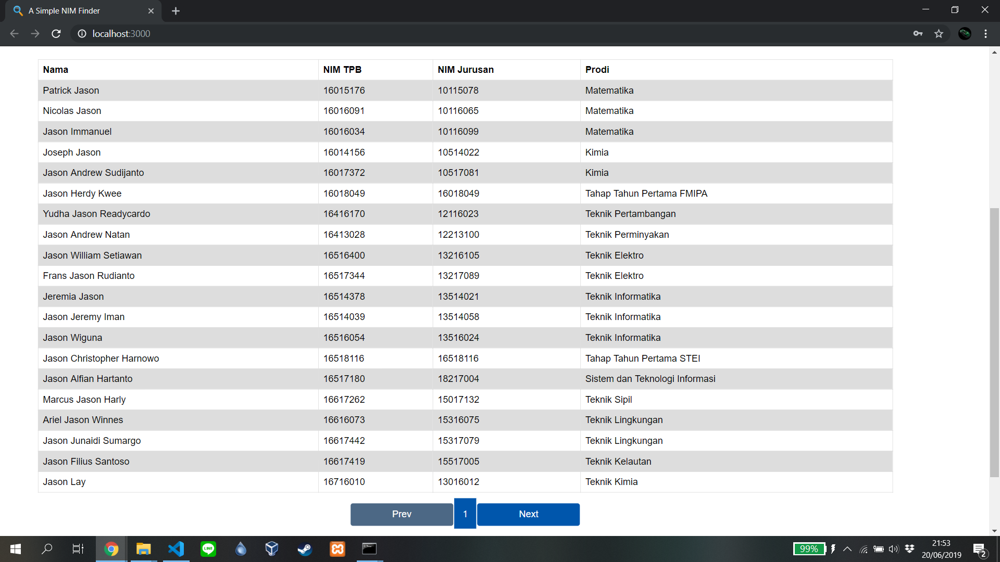

# A Simple NIM Finder

## Seleksi 2 Labpro

## Nama: Ferdy Santoso

## NIM : 13517116

### `I. Cara Memasang/Menjalankan Aplikasi`

Aplikasi dapat dijalankan dengan membuka link : (https://ferdysan360.github.io/A-Simple-NIM-Finder)

dan jika aplikasi ingin dijalankan secara offline, file source code dapat diunduh dari repository di github proyek ini : (https://github.com/ferdysan360/Simple-NIM-Finder-Project).

**Notes** : Saya menggunakan create-react-app dan secara *default* create-react-app memiliki folder "build" dan "node modules", kedua folder tersebut tidak saya unggah ke repository github saya karena kedua folder tersebut memiliki 20000+ file, sehingga terlalu banyak untuk diunggah ke repository github saya. Maka jika asisten ingin mencoba secara offline, saya asumsikan kedua folder tersebut sudah ada di komputer masing-masing asisten

**Notes 2** : Saya menggunakan repository berbeda untuk menjalankan aplikasi saya melalui gh-pages. Repository untuk hasil build gh-pages saya ada di link berikut : (https://github.com/ferdysan360/A-Simple-NIM-Finder)

### `II. Cara Menggunakan Aplikasi`

Saat aplikasi pertama kali dibuka, akan ada halaman register dan login serta search seperti di bawah ini :

Kita dapat mengisi kolom Username dan Password, jika Username dan password kita belum terdaftar maka klik **Register**, jika sudah maka klik **Login**. 

Jika Username dan password anda sudah benar, maka anda akan berhasil melakukan login :

Lalu, jika kita ingin melakukan pencarian, masukkan nama atau NIM mahasiswa yang ingin anda cari di kolom pencarian. Jika anda memasukan nama, maka klik tombol **Search by Name**, jika anda memasukan NIM, maka klik tombol **Search by NIM**. Akan dikeluarkan Nama, NIM TPB, NIM Jurusan, dan Prodi mahasiswa yang anda cari :

Jika anda melakukan *refresh* terhadap halaman website anda, maka user yang terakhir melakukan login akan otomatis dilakukan login ke NIM Finder ini :

**Notes** : Aplikasi akan terlihat lebih baik jika dibuka di web browser desktop

### `III. Desain Aplikasi`

Di aplikasi ini saya membuat *class* PostForm (terdapat di file PostForm.js) yang merupakan turunan dari React.Component, sehingga saya perlu melakukan *inheritance* di *class* tersebut. *class* PostForm* memiliki 13 atribut dan 14 method.

**Cara Kerja** aplikasi ini adalah :

Saat pengguna memasukan Username dan Password ke kolom **Username** dan **Password** dan lalu melakukan Register/Login, hasil masukan tersebut akan diubah dari bentuk object javascript ke bentuk url-encoded, yang lalu akan dilakukan **POST** request ke API NIM Finder yang disediakan.

Jika Register/Login berhasil, username dan token hasil login akan disimpan di dalam cookies agar dapat digunakan saat mengakses website di lain waktu. Token hasil login akan disimpan untuk melakukan searching.

Saat pengguna memasukan Nama/NIM ke kolom pencarian dan lalu melakukan pencarian (byName atau byId), hasil masukan tersebut akan diubah dari bentuk object ke bentuk url-encoded, yang lalu akan dilakukan **GET** request ke API NIM Finder yang disediakan. Hasil **GET** request tadi akan disimpan ke dalam array mahasiswa yang nantinya akan ditampilkan ke layar dalam bentuk tabel.

**Design Pattern** yang saya gunakan adalah *Filter Design Pattern*, design pattern tersebut saya rasa paling cocok karena di Filter design pattern ada mekanisme *filtering* yang digunakan, di dalam aplikasi yang saya buat juga membutuhkan filtering dalam melakukan pencarian mahasiswa, sehingga design pattern ini cocok digunakan.

### `IV. Library/Kakas yang Digunakan`

1. React js (dokumentasi : https://reactjs.org/)
2. Node js (untuk melakukan build) (dokumentasi : https://nodejs.org/en/)

### `V. Review Terhadap Desain API yang Ada`

### API NIM Finder (https://api.stya.net/nim) :

#### Sudah Baik :

1. Sudah dapat melakukan handle Register dan Login dengan baik (kemungkinan berhasil maupun error)
2. Sudah dapat melakukan handle Searching dengan baik (kemungkinan berhasil maupun error)

#### Kurang Baik :

1. Tidak ada total mahasiswa atau total halaman dalam response JSON API saat melakukan searching, sehingga paginasi kurang sempurna, karena umumnya hanya dapat melakukan previous dan next saja. Lebih baik jika response JSON API mengembalikan total mahasiswa atau total halaman dari hasil pencarian.

2. Saat melakukan pencarian dengan input *135171* (salah satu contoh), hasil pencarian dari API tidak hanya mengeluarkan mahasiswa dengan NIM *135171xx* namun API juga mengeluarkan mahasiswa dengan NIM *13517xx1* dan *13517x1x*. Menurut saya akan lebih baik dan lebih intuitif bagi user jika API hanya mengembalikan mahasiswa dengan NIM *135171xx* saja.
